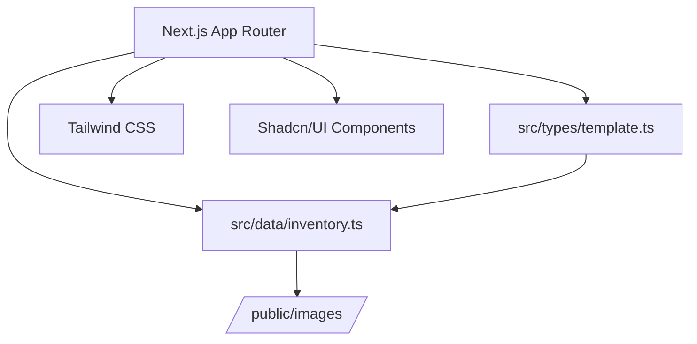

# Design Document: Phase 1 Foundation

## Overview

Phase 1 establishes the technical foundation for the SaaS Landing Page Showcase. This is a static Next.js application deployed on Vercel with TypeScript for type safety, Tailwind CSS for styling, and Shadcn/UI for accessible components. The data layer consists of TypeScript interfaces and a static inventory file.

## Architecture



The architecture is a simple static site:

- **Next.js App Router**: Handles routing and static generation
- **TypeScript Types**: Define data structures in `src/types/`
- **Static Data**: Template inventory in `src/data/`
- **Assets**: Images in `/public/images/`

## Components and Interfaces

### TypeScript Interfaces

```typescript
// src/types/template.ts

export type Category = "DevTool" | "B2C" | "Enterprise" | "SaaS";

export type Vibe = "Playful" | "Serious" | "Dark" | "Minimal" | "Bold";

export type TechStack = "React" | "Next.js" | "Tailwind" | "Shadcn";

export interface Prompt {
  system: string;
  user: string;
}

export interface Template {
  id: string;
  slug: string;
  title: string;
  description: string;
  thumbnail: string;
  preview: string;
  prompt: Prompt;
  category: Category[];
  vibe: Vibe[];
  techStack: TechStack[];
  isChefsChoice: boolean;
}
```

### Validation Function

```typescript
// src/lib/validation.ts

export function validateTemplate(template: Template): boolean {
  const requiredStrings = [
    template.id,
    template.slug,
    template.title,
    template.description,
    template.thumbnail,
    template.preview,
    template.prompt.system,
    template.prompt.user,
  ];
  return requiredStrings.every(
    (s) => typeof s === "string" && s.trim().length > 0
  );
}
```

## Data Models

### Template Inventory Structure

```typescript
// src/data/inventory.ts

import { Template } from "@/types/template";

export const TEMPLATE_INVENTORY: Template[] = [
  {
    id: "1",
    slug: "modern-saas-hero",
    title: "Modern SaaS Hero",
    description: "Clean hero section with gradient background",
    thumbnail: "/images/modern-saas-thumb.webp",
    preview: "/images/modern-saas-preview.webp",
    prompt: {
      system: "You are a frontend developer...",
      user: "Create a modern SaaS landing page...",
    },
    category: ["SaaS"],
    vibe: ["Minimal"],
    techStack: ["Next.js", "Tailwind"],
    isChefsChoice: true,
  },
  // ... 2-4 more templates
];
```

## Correctness Properties

_A property is a characteristic or behavior that should hold true across all valid executions of a system-essentially, a formal statement about what the system should do. Properties serve as the bridge between human-readable specifications and machine-verifiable correctness guarantees._

### Property 1: Template JSON Round-Trip

_For any_ valid Template object, serializing to JSON and deserializing back SHALL produce an object equivalent to the original.

**Validates: Requirements 2.3**

### Property 2: Template Validation Rejects Empty Fields

_For any_ Template object with at least one empty required string field, the validation function SHALL return false.

**Validates: Requirements 2.4**

### Property 3: Image Paths Are Relative to Public

_For any_ Template in the inventory, the thumbnail and preview paths SHALL start with `/images/`.

**Validates: Requirements 3.2**

### Property 4: Prompts Have Both Sections

_For any_ Template in the inventory, the prompt SHALL have non-empty system and user strings.

**Validates: Requirements 3.3**

## Error Handling

- TypeScript compiler catches type mismatches at build time
- Validation function returns boolean for runtime checks
- Build fails if TypeScript errors exist

## Testing Strategy

### Property-Based Testing

Use **fast-check** for property-based testing in TypeScript.

Configuration:

- Minimum 100 iterations per property test
- Tests tagged with format: `**Feature: phase1-foundation, Property {number}: {property_text}**`

### Unit Tests

- Verify inventory exports non-empty array
- Verify each template in inventory passes validation
- Verify build succeeds with `next build`

### Test File Location

Tests in `src/__tests__/` directory using Jest + fast-check.
