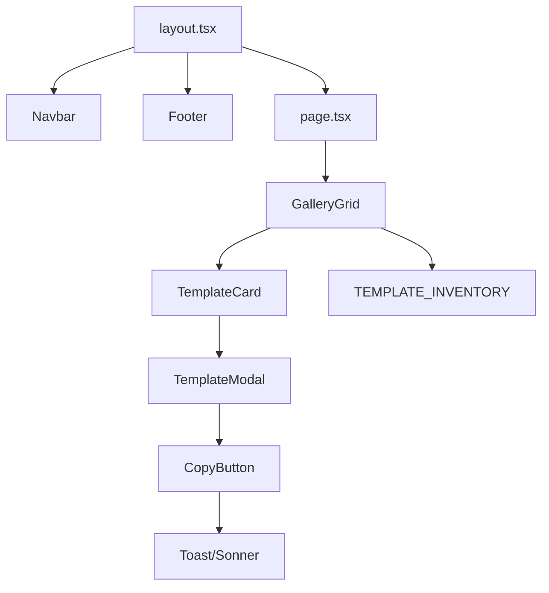

# Design Document: Phase 2 Core MVP

## Overview

Phase 2 implements the primary user flow: Browse → View Detail → Copy Prompt. This includes a global layout with navigation, a responsive gallery grid, a template detail modal, and clipboard functionality with user feedback.

## Architecture



## Components and Interfaces

### Component Structure

```
src/
├── app/
│   ├── layout.tsx          # Global layout with Navbar/Footer
│   └── page.tsx            # Home page with GalleryGrid
├── components/
│   ├── Navbar.tsx          # Site header
│   ├── Footer.tsx          # Site footer
│   ├── GalleryGrid.tsx     # Template grid container
│   ├── TemplateCard.tsx    # Individual template card
│   ├── TemplateModal.tsx   # Detail modal dialog
│   └── CopyButton.tsx      # Clipboard copy with feedback
```

### Component Props

```typescript
// TemplateCard props
interface TemplateCardProps {
  template: Template;
  onSelect: (template: Template) => void;
}

// TemplateModal props
interface TemplateModalProps {
  template: Template | null;
  open: boolean;
  onClose: () => void;
}

// CopyButton props
interface CopyButtonProps {
  prompt: Prompt;
}
```

## Data Models

Uses existing `Template` and `Prompt` types from Phase 1 (`src/types/template.ts`).

### Clipboard Format Function

```typescript
// src/lib/clipboard.ts
export function formatPromptForClipboard(prompt: Prompt): string {
  return `## System Prompt\n${prompt.system}\n\n## User Prompt\n${prompt.user}`;
}
```

## Correctness Properties

_A property is a characteristic or behavior that should hold true across all valid executions of a system-essentially, a formal statement about what the system should do. Properties serve as the bridge between human-readable specifications and machine-verifiable correctness guarantees._

### Property 1: Chef's Choice Badge Consistency

_For any_ Template object, if `isChefsChoice` is true, then the rendered TemplateCard SHALL contain a "Chef's Choice" badge element; if false, the badge SHALL NOT be present.

**Validates: Requirements 2.2**

### Property 2: Modal Displays Both Prompt Sections

_For any_ Template displayed in the modal, the rendered content SHALL contain both the system prompt text and the user prompt text.

**Validates: Requirements 3.3**

### Property 3: Copy Function Produces Combined Prompt

_For any_ Prompt object, the `formatPromptForClipboard` function SHALL return a string containing both the system and user prompt text.

**Validates: Requirements 4.1**

## Error Handling

- **Clipboard API failure**: Catch error and display toast with error message
- **Missing images**: next/image handles fallback; use placeholder if needed
- **Empty inventory**: Display "No templates available" message

## Testing Strategy

### Property-Based Testing

Use **fast-check** for property-based testing.

Configuration:

- Minimum 100 iterations per property test
- Tests tagged with format: `**Feature: phase2-core-mvp, Property {number}: {property_text}**`

### Unit Tests

- Verify `formatPromptForClipboard` returns string with both sections
- Verify TemplateCard renders badge when `isChefsChoice` is true
- Verify modal displays prompt content

### Test File Location

Tests in `src/__tests__/` directory using Jest + fast-check.
