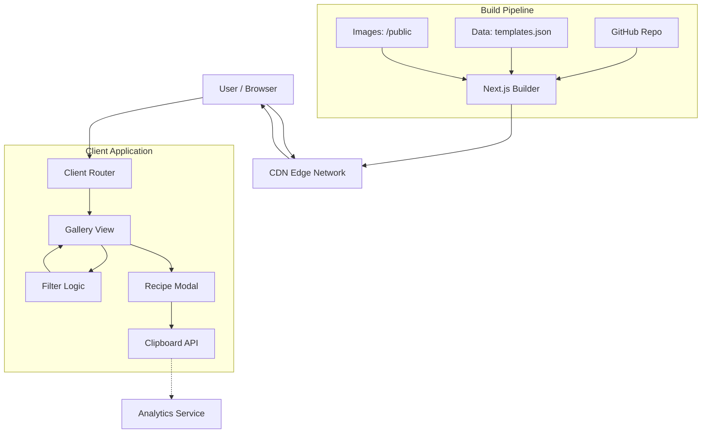

# Architecture Context - “SaaS Landing Page Showcase + Prompt Generator”

B

This steering file provides architectural context for Kiro to follow established patterns and code organization standards.

## Architectural Patterns

### High-Level Description

The system follows a **Jamstack (JavaScript, APIs, and Markup)** architecture, specifically utilizing a **Static Site Generation (SSG)** approach. Given the requirement for zero backend complexity and high performance, the application will be built as a Single Page Application (SPA) where the "database" is a static JSON configuration file bundled with the build.

The entire application is served via a Content Delivery Network (CDN), ensuring sub-second load times globally. All logic regarding filtering, searching, and prompt copying occurs client-side in the user's browser.

### Architectural Pattern: Static Client-Side Monolith

We are choosing a **Serverless/Static architecture**.
*   **Why:** The data set (3-5 templates initially, maybe 50 eventually) is small enough to be loaded into memory on the client. This eliminates database latency, hosting costs for a backend server, and authentication complexity.
*   **Trade-off:** Updating templates requires a code commit and redeployment (CI/CD handles this automatically). This is acceptable for a curated "Omakase" menu where updates are deliberate and not user-generated.

### System Interaction Diagram

---

## Layer Responsibilities & Boundaries

## Code Organization

*   **Platform:** **Vercel**
    *   *Why:* Zero-configuration deployment for Next.js. Free tier is sufficient for the MVP. Includes built-in CI/CD.
*   **CDN:** **Vercel Edge Network** (included).

## Naming Conventions

## Import Patterns

