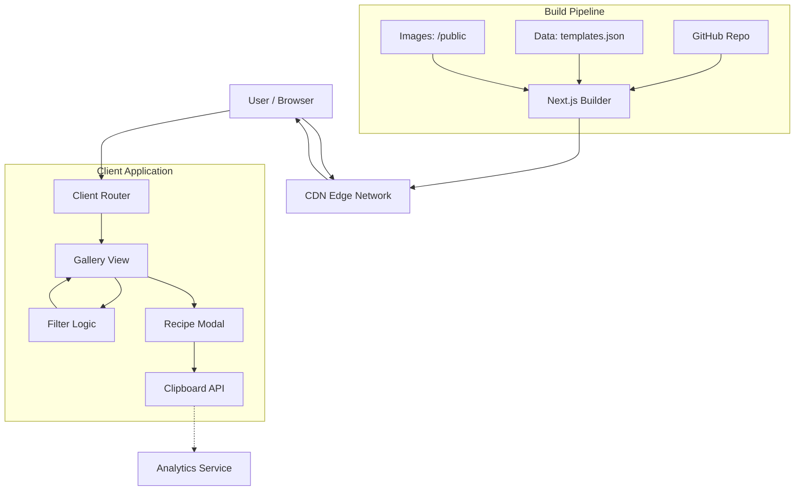

## 1. Architecture Overview

### High-Level Description
The system follows a **Jamstack (JavaScript, APIs, and Markup)** architecture, specifically utilizing a **Static Site Generation (SSG)** approach. Given the requirement for zero backend complexity and high performance, the application will be built as a Single Page Application (SPA) where the "database" is a static JSON configuration file bundled with the build.

The entire application is served via a Content Delivery Network (CDN), ensuring sub-second load times globally. All logic regarding filtering, searching, and prompt copying occurs client-side in the user's browser.

### Architectural Pattern: Static Client-Side Monolith
We are choosing a **Serverless/Static architecture**.
*   **Why:** The data set (3-5 templates initially, maybe 50 eventually) is small enough to be loaded into memory on the client. This eliminates database latency, hosting costs for a backend server, and authentication complexity.
*   **Trade-off:** Updating templates requires a code commit and redeployment (CI/CD handles this automatically). This is acceptable for a curated "Omakase" menu where updates are deliberate and not user-generated.

### System Interaction Diagram



---

## 2. Technology Stack Recommendations

### Frontend (The Core)
*   **Framework:** **Next.js (App Router)**
    *   *Why:* Provides excellent image optimization (`next/image`) which is critical for a visual gallery. Supports Static Exports (`output: 'export'`) to run entirely on a CDN.
    *   *Language:* **TypeScript**. Ensures type safety for the template data structures, reducing runtime errors.
*   **Styling:** **Tailwind CSS**
    *   *Why:* Rapid UI development. The utility-first approach makes implementing "Dark Mode" (a P2 requirement) and responsive grids trivial.
*   **Component Library:** **shadcn/ui** (built on Radix UI)
    *   *Why:* Provides accessible, high-quality unstyled components (Dialogs, Toasts, Cards) that can be easily customized to fit the "Fine Dining" aesthetic without writing logic from scratch.
*   **State Management:** **React Context + URL Search Params**
    *   *Why:* We need to persist filters (e.g., `?category=devtool`) so users can share links. We do not need a heavy global state library like Redux.

### Backend & Database
*   **None.** (As per PRD constraints).
*   *Data Source:* A strictly typed `data/templates.ts` or `templates.json` file.

### Infrastructure & Hosting
*   **Platform:** **Vercel**
    *   *Why:* Zero-configuration deployment for Next.js. Free tier is sufficient for the MVP. Includes built-in CI/CD.
*   **CDN:** **Vercel Edge Network** (included).

### Third-Party Services
*   **Analytics:** **Vercel Web Analytics** or **PostHog (Free Tier)**
    *   *Why:* Privacy-friendly. Essential for tracking the "Prompt Copy Rate" and "Time to Value" metrics defined in the PRD.

---

## 3. Data Models & Database Schema

Since there is no SQL database, our "Schema" is defined via TypeScript interfaces. This ensures consistency across the hardcoded data file.

### Core Entity: `Template`

```typescript
// types/template.ts

export type Category = 'DevTool' | 'AI Wrapper' | 'E-commerce' | 'SaaS' | 'Agency';
export type Vibe = 'Playful' | 'Serious' | 'Dark' | 'Minimalist';
export type TechStack = 'Tailwind' | 'CSS Modules' | 'Shadcn' | 'Bootstrap';

export interface PromptSection {
  role: 'system' | 'user';
  content: string;
}

export interface Template {
  id: string;              // Unique slug, e.g., "minimalist-api-dashboard"
  title: string;           // e.g., "The Minimalist API"
  description: string;     // Short marketing copy for the card
  thumbnailUrl: string;    // Path to optimized WebP image (400x300)
  fullPreviewUrl: string;  // Path to high-res WebP image
  
  // Metadata for Filtering (P1)
  categories: Category[];
  vibes: Vibe[];
  
  // The "Recipe"
  techStack: TechStack[];  // Used for P1 toggle features
  prompt: {
    system: string;        // The "Kiro Spec" context
    user: string;          // The specific visual description
  };
  
  // Metrics helper
  isChefsChoice?: boolean; // Renders the badge mentioned in P0
}
```

### Data Storage Strategy
Data will be stored in `src/data/inventory.ts`:

```typescript
import { Template } from '@/types/template';

export const TEMPLATE_INVENTORY: Template[] = [
  {
    id: "dark-mode-analytics",
    title: "The Dark Mode Analytics",
    description: "A data-heavy dashboard with glassmorphism accents.",
    thumbnailUrl: "/images/thumbnails/analytics.webp",
    fullPreviewUrl: "/images/previews/analytics.webp",
    categories: ["SaaS", "DevTool"],
    vibes: ["Dark", "Serious"],
    techStack: ["Tailwind"],
    prompt: {
      system: "You are an expert UI designer...",
      user: "Create a dashboard layout featuring a bento-grid..."
    },
    isChefsChoice: true
  },
  // ... other templates
];
```

---

## 4. API Specifications

As a static site, there are no REST/GraphQL endpoints. However, we must define the **URL Interface** (Client-Side Routing) to support deep linking and sharing.

### URL Structure

**1. Home / Gallery**
*   **Path:** `/`
*   **Query Parameters (Optional):**
    *   `category`: Filter by industry (e.g., `?category=DevTool`)
    *   `vibe`: Filter by style (e.g., `?vibe=Dark`)
    *   `q`: Text search query

**2. Template Detail (Modal)**
*   **Path:** `/template/[id]` (or `/?template=[id]` if using intercepting routes)
*   **Behavior:** Opens the "Recipe Card" modal over the gallery.
*   **Example:** `https://saas-showcase.com/?template=dark-mode-analytics`

**3. Remix Action (External)**
*   **Path:** Outbound link to v0.dev
*   **Format:** `https://v0.dev/new?q=[URL_ENCODED_PROMPT]`
*   **Function:** Pre-fills the prompt in the external tool (P2 Feature).

---

## 5. Security Considerations

Even without a backend, security practices are vital for reputation and user safety.

### 1. Content Security Policy (CSP)
*   **Strategy:** Implement strict CSP headers via `next.config.js`.
*   **Rule:** `default-src 'self'; img-src 'self' data:; script-src 'self' 'unsafe-eval' (for analytics);`
*   **Goal:** Prevent Cross-Site Scripting (XSS) attacks, ensuring no malicious scripts can be injected into the gallery.

### 2. Input Sanitization (Prompt Display)
*   **Risk:** Although prompts are currently hardcoded, if we ever allow dynamic rendering of markdown within the prompt text, there is an XSS risk.
*   **Mitigation:** Use a library like `dompurify` if rendering HTML from the prompt strings. For V1, we will render prompts as plain text or syntax-highlighted code blocks (using `prismjs` or similar) which inherently escape HTML.

### 3. DDoS Protection
*   **Implementation:** Rely on Vercel's Edge Network DDoS mitigation.
*   **Rate Limiting:** Not strictly necessary for a static site reading JSON, but Vercel provides automatic mitigation for abusive traffic patterns.

### 4. No PII Storage
*   **Policy:** We explicitly do not collect email addresses or user data. Analytics must be configured to be anonymous (cookie-less mode recommended).

---

## 6. Scalability & Performance

### Performance Targets
*   **LCP (Largest Contentful Paint):** < 1.2s (User perceives instant loading).
*   **CLS (Cumulative Layout Shift):** 0 (Prevents UI jumping).
*   **Time to Interaction:** < 0.5s.

### Optimization Strategy

1.  **Image Optimization (Critical Path):**
    *   The "Menu" relies heavily on images. We will use `next/image` to:
        *   Automatically serve WebP/AVIF formats.
        *   Generate distinct sizes for mobile/desktop (responsive `srcset`).
        *   Enforce explicit width/height to prevent CLS.
        *   Lazy load images below the fold.

2.  **Bundle Splitting:**
    *   The "Recipe Modal" code and the full prompt text should be lazy-loaded. The main bundle only needs the thumbnails and titles.
    *   Use `next/dynamic` to load the heavy "Syntax Highlighter" component only when a user clicks a card.

3.  **Search Performance:**
    *   Filtering is client-side. With < 100 templates, `array.filter()` is instant (microseconds). No complex indexing needed.

---

## 7. Deployment Strategy

### Infrastructure as Code
*   **Configuration:** `vercel.json` (if needed for header overrides) and `next.config.js`.

### CI/CD Pipeline
We will use **GitHub Actions** (or Vercel's built-in Git integration).

1.  **Development:**
    *   Developer pushes code to feature branch.
    *   `npm run lint` and `npm run build` run locally.
2.  **Pull Request (Staging):**
    *   Vercel automatically creates a **Preview Deployment**.
    *   URL is shared with the team to verify the new "Dish" (Template).
3.  **Production:**
    *   Merge to `main`.
    *   Vercel builds the static assets.
    *   Atomic deployment switches traffic instantly.

### Monitoring
*   **Vercel Dashboard:** Monitor build status and bandwidth usage.
*   **Client-Side Error Logging:** Minimal implementation (e.g., `Sentry` free tier) to catch if the JSON fails to parse or images 404 on specific devices.

---

## 8. Third-party Integrations

| Service | Purpose | Integration Method | Cost / Limits | Fallback |
| :--- | :--- | :--- | :--- | :--- |
| **Vercel Analytics** | Track "Prompt Copy Rate" (PCR) | NPM Package (`@vercel/analytics`) | Free (Hobby) | Fail silently (non-critical) |
| **Lucide React** | Icons (Copy, Close, Filter) | NPM Library | Free (MIT) | N/A (Bundled) |
| **Radix UI** | Accessible Modal/Dialog primitives | NPM Library | Free (MIT) | N/A (Bundled) |
| **v0.dev** | "Remix" destination | URL Parameters | Free | User navigates manually |

### Integration Details: Analytics
To measure the **Success Metrics** defined in the PRD:

```typescript
// Example usage in CopyButton component
import { track } from '@vercel/analytics';

const handleCopy = () => {
  navigator.clipboard.writeText(prompt);
  toast("Recipe Copied!");
  
  // Track the KPI
  track('Prompt Copied', {
    templateId: template.id,
    templateName: template.title
  });
};
```