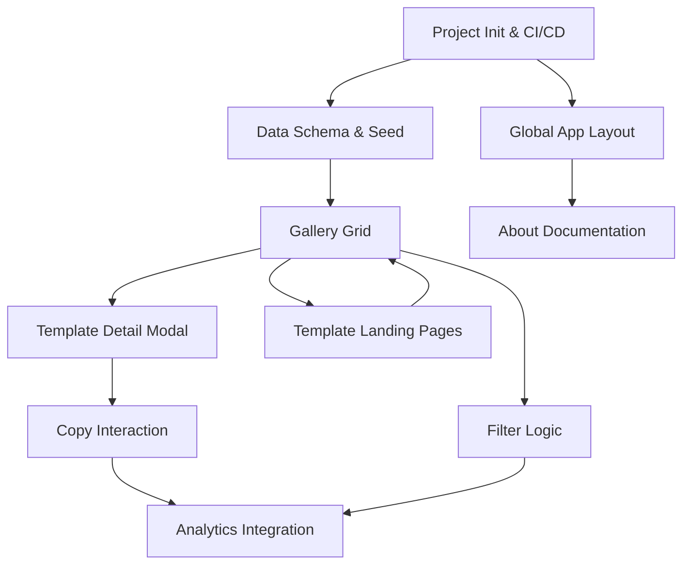

## 1. MVP Overview

This MVP delivers a static, high-performance gallery of SaaS landing page templates ("The Menu") that provides users with pre-engineered AI prompts ("Recipes") to recreate designs in tools like v0 or Bolt. It solves "Blank Canvas Paralysis" by bridging the gap between visual taste and prompt engineering, allowing users to copy-paste their way to a high-fidelity landing page without writing code.

## 2. Build Phases

### Phase 1: Foundation (The Kitchen Setup)

**Goal:** Establish the technical infrastructure, type safety, and data layer.

- **Milestones:** Project initialization, CI/CD pipeline, Data Schema definition, Asset preparation.
- **Prioritization:** All P0 (Blocked by nothing).
- **Dependencies:** None.
- **Resource Considerations:** Requires 3-5 high-quality screenshots of "Gold Standard" templates.
- **Risk Mitigation:** Verify image optimization settings early to prevent LCP issues.
- **Success Criteria:** Repo deployed to Vercel; JSON data renders to console; static assets load via CDN.

### Phase 2: Core MVP (The Menu & Dish)

**Goal:** Enable the primary user flow: Browse -> View Detail -> Copy Prompt.

- **Milestones:** Global Layout, Gallery Grid, Detail Modal, Clipboard Interaction.
- **Prioritization:** P0 (Must Have).
- **Dependencies:** Phase 1 (Data Layer).
- **Resource Considerations:** Frontend development focus (Next.js/Tailwind).
- **Risk Mitigation:** Test "Copy" functionality across browsers (Safari/Chrome) due to clipboard API permissions.
- **Success Criteria:** User can select a template and copy the prompt text to clipboard with visual confirmation.

### Phase 3: MVP Complete (The Service)

**Goal:** Add template landing pages, and educational context.

- **Milestones:** Template Landing Pages, Client-side Filtering, "About Kiro" Documentation, Tech Stack Toggles.
- **Prioritization:** P1 (Should Have).
- **Dependencies:** Phase 2 (Gallery & Modal).
- **Resource Considerations:** Logic implementation for URL-based state. Frontend development for individual template pages.
- **Risk Mitigation:** Ensure URL parameters sync correctly with UI state to support deep linking. Template pages should be self-contained and not affect main app bundle size.
- **Success Criteria:** Each template has a dedicated landing page that serves as the visual preview.

### Phase 4: Post-MVP Enhancements (The Polish)

**Goal:** Improve UX and integration with external tools.

- **Milestones:** Dark Mode, v0 "Remix" Deep Links, Analytics.
- **Prioritization:** P2 (Could Have).
- **Dependencies:** Phase 3.
- **Success Criteria:** >40% prompt copy rate (via analytics tracking).

## 3. Feature Specifications

### Feature: Project Initialization & CI/CD

- **Phase**: 1
- **User Story**: As a developer, I want the repo set up with the correct framework and deployment pipeline so I can begin coding features.
- **Acceptance Criteria**:
  - [ ] Next.js (App Router) project initialized with TypeScript
  - [ ] Tailwind CSS configured and working
  - [ ] Shadcn/UI CLI initialized
  - [ ] Vercel deployment connected to GitHub main branch
  - [ ] Strict Content Security Policy (CSP) headers configured in `next.config.js`
- **Technical Notes**: Use `create-next-app`. Configure `output: 'export'` if strictly static, or standard Vercel build. Install `lucide-react`.
- **Dependencies**: None
- **Scope**: Small

### Feature: Data Schema & Seed Inventory

- **Phase**: 1
- **User Story**: As a developer, I need a structured data source for templates so that the UI can render consistent content without a database.
- **Acceptance Criteria**:
  - [ ] TypeScript interfaces defined for `Template`, `Category`, `Vibe`, and `TechStack`
  - [ ] `inventory.ts` created containing data for 3-5 initial templates
  - [ ] Images (thumbnails and full previews) placed in `/public/images` and referenced in inventory
  - [ ] Prompts formatted with distinct `system` and `user` sections
- **Technical Notes**: Define types in `src/types/template.ts`. Ensure images are WebP format for performance.
- **Dependencies**: Project Initialization
- **Scope**: Small

### Feature: Global App Layout

- **Phase**: 2
- **User Story**: As a user, I want a consistent navigation and footer experience so I understand what the tool is.
- **Acceptance Criteria**:
  - [ ] Responsive Navbar with Logo/Title
  - [ ] Simple Footer with copyright and "Built with Kiro" links
  - [ ] "About" button in Navbar (placeholder for now)
  - [ ] Layout handles proper SEO meta tags (Title, Description)
- **Technical Notes**: Use Next.js `layout.tsx`. Use Shadcn `NavigationMenu` (optional) or simple flexbox header.
- **Dependencies**: Project Initialization
- **Scope**: Small

### Feature: Gallery Grid (The Menu)

- **Phase**: 2
- **User Story**: As a user, I want to view thumbnails of all available templates so I can choose one that fits my aesthetic.
- **Acceptance Criteria**:
  - [ ] Responsive grid layout (1 col mobile, 2 col tablet, 3 col desktop)
  - [ ] Cards display Thumbnail, Title, and Description
  - [ ] "Chef’s Choice" badge renders conditionally based on `isChefsChoice` boolean
  - [ ] Images use `next/image` for optimization
  - [ ] Hover states on cards (slight lift or border highlight)
- **Technical Notes**: Map through `TEMPLATE_INVENTORY`. Use Shadcn `Card` component. Implement lazy loading for images below the fold.
- **Dependencies**: Data Schema & Seed Inventory
- **Scope**: Medium

### Feature: Template Detail Modal (Recipe Card)

- **Phase**: 2
- **User Story**: As a user, I want to see the full design and the prompt details without leaving the page.
- **Acceptance Criteria**:
  - [ ] Clicking a Gallery Card opens a Modal (Dialog)
  - [ ] Modal URL updates (e.g., `/?template=slug`) for shareability (Interception Route)
  - [ ] Left side: Large scrollable preview image
  - [ ] Right side: "Ingredients" section displaying the text prompt
  - [ ] Prompt text is read-only and clearly formatted
- **Technical Notes**: Use Shadcn `Dialog` or `Sheet`. Use Next.js Intercepting Routes for the URL behavior, or simple state if deep linking is deferred to Phase 3.
- **Dependencies**: Gallery Grid
- **Scope**: Large

### Feature: Copy to Clipboard Interaction

- **Phase**: 2
- **User Story**: As a user, I want to copy the prompt with one click so I can paste it into my AI tool.
- **Acceptance Criteria**:
  - [ ] "Copy Recipe" button prominent in the Modal
  - [ ] Clicking button copies `system` + `user` prompt to clipboard
  - [ ] Toast notification appears ("Recipe Copied!") upon success
  - [ ] Error handling if clipboard permission is denied
- **Technical Notes**: Use `navigator.clipboard.writeText()`. Use Shadcn `Toast` or `Sonner`.
- **Dependencies**: Template Detail Modal
- **Scope**: Small

### Feature: Template Landing Pages (Live Previews)

- **Phase**: 3
- **User Story**: As a user, I want to see a real, interactive landing page for each template so I can evaluate the design before copying the prompt.
- **Acceptance Criteria**:
  - [ ] Each template in inventory has a dedicated page at `/templates/[slug]`
  - [ ] Landing pages are built implementing the actual design described in the prompt
  - [ ] Gallery cards reference these pages as their preview/thumbnail source
  - [ ] Template pages are self-contained with their own styling (no shared layout with main app)
  - [ ] Inventory updated to link thumbnails/previews to template page routes or screenshots
- **Technical Notes**: Create pages under `src/app/templates/[slug]/page.tsx`. Each page implements the landing design described in its prompt. Use `generateStaticParams` for SSG. These pages serve as both live demos and the source for preview images.
- **Dependencies**: Data Schema & Seed Inventory, Gallery Grid
- **Scope**: Large

### Feature: Filter Logic (Dietary Restrictions)

- **Phase**: 3
- **User Story**: As a user, I want to filter templates by category or vibe so I can find relevant designs quickly.
- **Acceptance Criteria**:
  - [ ] Filter bar above Gallery Grid
  - [ ] Filter by: Category (Multi-select) and Vibe (Multi-select)
  - [ ] URL Query Params update instantly (`?category=SaaS`)
  - [ ] Grid re-renders immediately without page reload
  - [ ] "Clear All" button appears when filters are active
- **Technical Notes**: Use `useSearchParams` and `useRouter` from `next/navigation`. Logic should filter the `TEMPLATE_INVENTORY` array in memory.
- **Dependencies**: Gallery Grid
- **Scope**: Medium

### Feature: About / Implementation Documentation

- **Phase**: 3
- **User Story**: As a user, I want to know how this site was built so I can learn to use Kiro myself.
- **Acceptance Criteria**:
  - [ ] "How it's Made" Modal or Page
  - [ ] Displays the actual Kiro Spec used to generate the gallery app
  - [ ] Explains the "Omakase" concept
- **Technical Notes**: Static content page. Can use a Markdown renderer or hardcoded JSX.
- **Dependencies**: Global App Layout
- **Scope**: Small

### Feature: Analytics Integration

- **Phase**: 4
- **User Story**: As a product owner, I want to track which prompts are copied so I can understand user preferences.
- **Acceptance Criteria**:
  - [ ] Vercel Web Analytics (or PostHog) initialized
  - [ ] Custom event fired on "Copy Recipe" click
  - [ ] Custom event fired on "Filter Select"
- **Technical Notes**: Use `@vercel/analytics`. Ensure privacy-friendly configuration (no PII).
- **Dependencies**: Copy to Clipboard Interaction
- **Scope**: Small

## 4. Dependency Graph

## 5. Critical Path

1. **Project Initialization & CI/CD** - Phase 1
2. **Data Schema & Seed Inventory** - Phase 1
3. **Global App Layout** - Phase 2
4. **Gallery Grid** - Phase 2
5. **Template Detail Modal** - Phase 2
6. **Copy to Clipboard Interaction** - Phase 2
7. **Template Landing Pages** - Phase 3
8. **Filter Logic** - Phase 3
9. **About / Implementation Documentation** - Phase 3

## 6. Out of Scope (Explicitly Deferred)

- **User Authentication**: Adds complexity (database, session management) without validating the core value of the prompts.
- **Backend / Database**: The MVP content (3-5 templates) is small enough to be hardcoded, ensuring zero latency and zero hosting cost.
- **Payment Processing**: The goal is user acquisition and utility validation, not immediate monetization.

## 7. Technical Risks

- **Risk**: **Clipboard API limitations**. Some browsers block clipboard access if not triggered by a direct user event.
  - **Mitigation**: Ensure the "Copy" function is attached directly to the `onClick` handler of the button, not inside an async promise chain or timeout.
- **Risk**: **Image Performance (LCP)**. High-res preview images could slow down the initial load.
  - **Mitigation**: Use `next/image` with proper `sizes` prop. Ensure thumbnails are small (<50KB) and Full Previews are lazy-loaded only when the modal opens.
- **Risk**: **Prompt Hallucination**. Users might copy a prompt but get a different result in their AI tool.
  - **Mitigation**: Add a disclaimer in the UI: "AI results may vary." rigorously test prompts in v0/Bolt before adding to `inventory.ts`.
