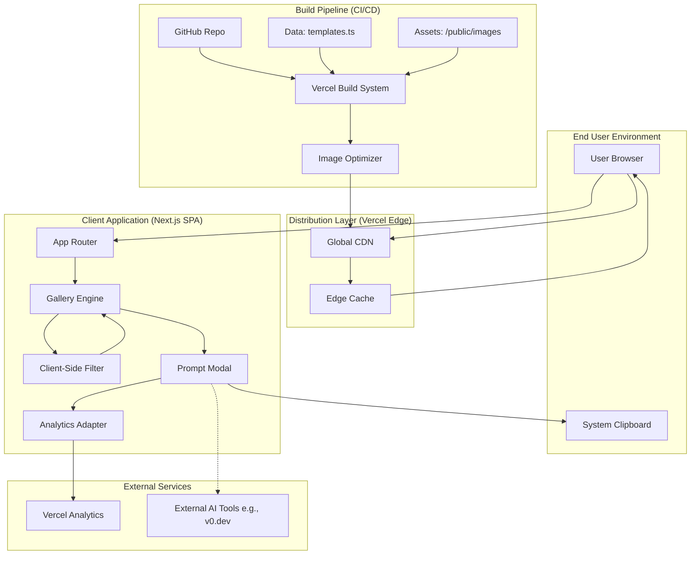
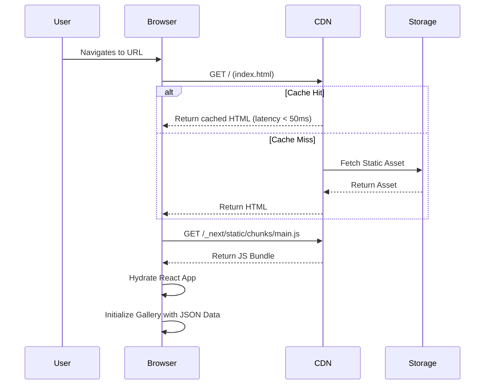
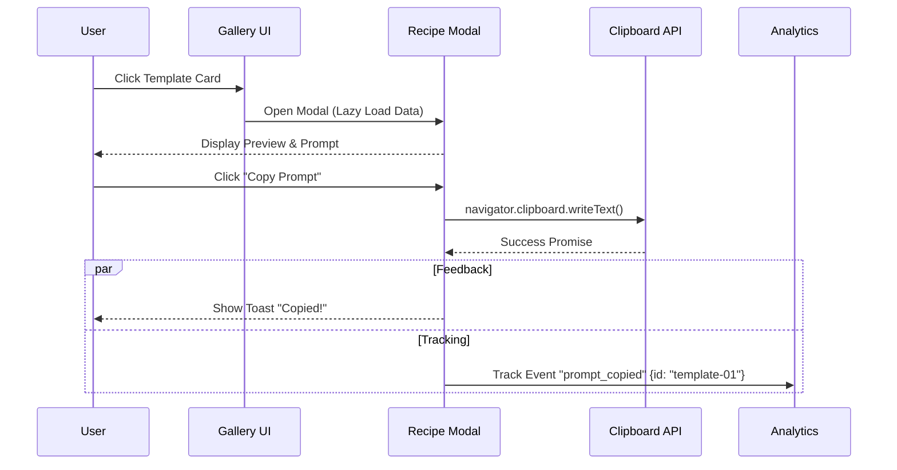

## 1. System Architecture Diagram

The system utilizes a **Serverless / Static Site Generation (SSG)** architecture. The entire application logic, data, and assets are pre-built and distributed via a global Content Delivery Network (CDN). There is no persistent runtime server or database connection required during user interaction.

---

## 2. Component Breakdown

### 1. Client Application (Frontend Core)
*   **Purpose**: Delivers the visual gallery interface, handles user interactions, and manages the "copy prompt" workflow.
*   **Responsibilities**:
    *   Routing (Home vs. Detail View).
    *   Rendering responsive image grids.
    *   Client-side filtering (by Category, Vibe, Tech Stack).
    *   Managing the Modal state and Clipboard interactions.
*   **Technology**: Next.js (App Router), React, TypeScript.
*   **Dependencies**: CDN for asset delivery.
*   **Scaling**: Infinite horizontal scaling (executed on client).
*   **Failure Mode**: If CDN fails, site is unreachable. If client JS fails, site renders static HTML (progressive enhancement).

### 2. Data Layer (Static Inventory)
*   **Purpose**: Acts as the "Database" for the application.
*   **Responsibilities**: Defines the schema for Templates, Prompts, Categories, and Metadata.
*   **Interfaces**: TypeScript Interfaces (`Template`, `PromptSection`).
*   **Technology**: TypeScript (`data/inventory.ts`).
*   **Scaling**: constrained by bundle size. Efficient up to ~500 items before pagination strategies are needed.
*   **Failure Mode**: Build-time validation ensures no broken data reaches production.

### 3. Image Optimization Engine
*   **Purpose**: Ensures the heavy visual gallery loads instantly on all devices.
*   **Responsibilities**:
    *   Converting source images to WebP/AVIF.
    *   Generating specific sizes for `srcset` (Mobile, Tablet, Desktop).
    *   Preventing Layout Shift (CLS).
*   **Technology**: `next/image` (utilizing Vercel Image Optimization API).
*   **Dependencies**: Source images in `/public`.
*   **Scaling**: Automatic via Vercel Edge.

### 4. Analytics Adapter
*   **Purpose**: Abstraction layer for tracking user engagement and KPIs.
*   **Responsibilities**:
    *   Tracking "Prompt Copy" events (Primary KPI).
    *   Tracking "Filter Usage" (Secondary KPI).
    *   Anonymizing user data (Privacy-first).
*   **Technology**: `@vercel/analytics` or PostHog (Lightweight).
*   **Failure Mode**: Fails silently (non-blocking) if ad-blockers intervene.

---

## 3. Data Flow

### Flow 1: Initial Page Load (SSG Delivery)
This flow represents how the user receives the application. The HTML is pre-computed at build time.

### Flow 2: Prompt Interaction & Analytics
This flow details the core value proposition: viewing a template and copying the prompt.

---

## 4. Integration Points

### 1. Browser Clipboard API
*   **Purpose**: To transfer the generated prompt text to the user's system clipboard for use in external tools.
*   **Protocol**: Native JavaScript API (`navigator.clipboard`).
*   **Security**: Requires a secure context (HTTPS) and user-initiated event (click).
*   **Error Handling**: Fallback to `document.execCommand('copy')` or displaying a manual "Select All" text area if API is blocked.

### 2. Vercel Analytics (or PostHog)
*   **Purpose**: Telemetry for business metrics.
*   **Data Exchanged**: Event Name, Template ID, Timestamp, Device Type, Geo (Country level only).
*   **Protocol**: HTTPS (XHR/Beacon).
*   **Failure Strategy**: "Fire and forget." If the analytics request fails, the user experience is unaffected.

### 3. External AI Builders (Deep Linking)
*   **Purpose**: Optional "Remix" button to open the prompt directly in tools like v0.dev or bolt.new.
*   **Protocol**: URL Parameters (GET).
*   **Example**: `https://v0.dev/new?q={URL_ENCODED_PROMPT}`
*   **Authentication**: Handled by the target platform (User must be logged in to v0).

---

## 5. Infrastructure Requirements

### Compute (Build Time Only)
*   **Provider**: Vercel (Serverless Build Container).
*   **Specification**: Standard Node.js environment (18.x or 20.x).
*   **Frequency**: Runs only on git push/merge.

### Storage & Content Delivery
*   **Primary Storage**: Git Repository (GitHub) for code and JSON data.
*   **Asset Storage**: Vercel Blob or bundled static assets for images.
*   **CDN**: Vercel Edge Network.
    *   **Caching**: `stale-while-revalidate` strategy for static assets.
    *   **Bandwidth**: Estimated 50-100GB/month (heavily dependent on image optimization).

### Network
*   **Protocol**: HTTP/2 or HTTP/3 (QUIC).
*   **Latency**: Target < 100ms TTFB (Time to First Byte) globally.
*   **DNS**: Managed via Vercel or external registrar (Cloudflare) pointing to Vercel CNAME.

### Security
*   **SSL/TLS**: Automatic provisioning via Let's Encrypt.
*   **Headers**: 
    *   `X-Content-Type-Options: nosniff`
    *   `X-Frame-Options: DENY`
    *   `Referrer-Policy: strict-origin-when-cross-origin`

### Cost Estimates (Monthly)
| Component | Tier | Estimated Cost | Notes |
| :--- | :--- | :--- | :--- |
| **Hosting (Vercel)** | Hobby / Pro | $0 - $20 | Free for personal/MVP usage. |
| **Domain** | .com | $12/year | ~ $1/month. |
| **Analytics** | Free Tier | $0 | Up to ~2.5k events/month usually free. |
| **Total** | | **~$1 - $20** | Extremely low overhead. |

---

## 6. Scalability Considerations

### Horizontal Scaling
*   **Strategy**: The application is purely static assets served via CDN. It scales infinitely by default.
*   **Mechanism**: Vercel's Edge Network replicates assets to 100+ locations globally. A traffic spike of 10k users results in 10k requests to the CDN, not a central server.

### Data Scaling (The "Client-Side Monolith" Limit)
*   **Current State**: All data is loaded in `main.js`.
*   **Limit**: ~500 Templates.
*   **Bottleneck**: If the JSON payload exceeds ~200KB, initial load times (LCP) will degrade.
*   **Future Mitigation**:
    1.  **Pagination**: Split the JSON into chunks (`page1.json`, `page2.json`).
    2.  **Server-Side Search**: If inventory grows >1000, move search logic to a Serverless Function (API Route) rather than client-side filtering.

### Image Scaling
*   **Challenge**: High-resolution landing page screenshots are heavy.
*   **Solution**:
    *   **Lazy Loading**: Only load images in the viewport.
    *   **Format**: Enforce WebP (approx 30% smaller than JPEG).
    *   **Dimensions**: Do not serve 4k images. Max width 1200px for previews, 400px for thumbnails.

---

## 7. Disaster Recovery & Backup

### Backup Strategy
*   **Code & Data**: The GitHub Repository is the single source of truth. It is version-controlled and distributed.
*   **Retention**: Git history provides infinite retention of data changes (template updates).

### Recovery Metrics
*   **RTO (Recovery Time Objective)**: < 10 minutes.
    *   *Scenario*: Bad deployment breaks the site.
    *   *Action*: Click "Rollback" in Vercel Dashboard to previous immutable deployment. Instant.
*   **RPO (Recovery Point Objective)**: 0 minutes.
    *   Since there is no user-generated data (database), no data can be lost.

### Failover Procedures
*   **CDN Outage**: Extremely rare. If Vercel goes down, DNS can be repointed to a secondary static host (e.g., Netlify or AWS S3) by pushing the repo to a secondary CI pipeline.
*   **Testing**: "Disaster Recovery" is tested implicitly every time a deployment is rolled back during development.

---

## 8. Monitoring & Observability

### Key Metrics (Core Web Vitals)
Since this is a visual showcase, UI performance is the primary technical metric.
*   **LCP (Largest Contentful Paint)**: Target < 2.5s. Measures loading performance.
*   **FID (First Input Delay)**: Target < 100ms. Measures interactivity.
*   **CLS (Cumulative Layout Shift)**: Target < 0.1. Crucial for a grid layout to prevent "jumping" images.

### Business Metrics (Analytics)
*   **Prompt Copy Rate (PCR)**: (Total Copies / Total Unique Visitors) * 100.
*   **Template Popularity**: Count of clicks per Template ID.
*   **Search Queries**: Log of terms entered in the search bar (to understand user demand).

### Logging & Alerting
*   **Build Logs**: Monitored in Vercel. Alerts on build failure (e.g., TypeScript errors, image optimization timeouts).
*   **Runtime Errors**:
    *   **Tool**: Sentry (Free Tier).
    *   **Scope**: Catch JavaScript exceptions (e.g., `LocalStorage` quota exceeded, JSON parsing errors on older browsers).
    *   **Alerting**: Email notification on spike in error rate > 1%.

### Recommended Observability Stack
| Layer | Tool | Purpose |
| :--- | :--- | :--- |
| **Infrastructure** | Vercel Dashboard | Bandwidth, Build Status, Function Invocations. |
| **Frontend Performance** | Google Lighthouse / PageSpeed | CI/CD check for Core Web Vitals. |
| **User Behavior** | PostHog / Vercel Analytics | Funnels, Conversion tracking. |
| **Error Tracking** | Sentry | Client-side exception catching. |